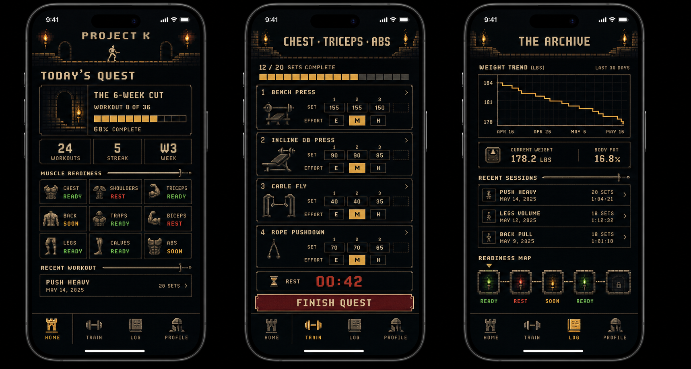

# Retro Quest Mobile Preview

## Summary

This direction presents Project K as a serious workout tracker with the visual language of a minimal cinematic platformer. The app should feel dramatic, spare, and satisfying without becoming an actual game.

The concept is inspired by late-1980s platformer atmosphere, but it must not copy Prince of Persia characters, logos, layouts, or identifiable IP. Treat the reference as mood: torchlight, stone, sparse motion, high-contrast silhouettes, and deliberate pacing.

## Product Mapping

| Product Term | Themed Label | Notes |
|---|---|---|
| Workout | Quest | Used on mobile surfaces only. |
| Program | Campaign | Communicates multi-workout progression. |
| Progress | Archive | History and stats become a record of completed work. |
| Readiness | Readiness Map | Muscle recovery becomes a status/map surface. |
| Finish Workout | Finish Quest | Motivational label; underlying action remains workout logging. |

## Sample Screens

| Screen | Purpose | Visual Treatment |
|---|---|---|
| Home | Shows current program, workout count, streak, readiness, and recent workout. | "Today's Quest" hero, stone-framed progress bar, compact stat tiles, readiness grid. |
| Workout / Quest | Lets users complete sets, enter weight, set effort, rest, swap exercises, and finish. | Exercise cards as chamber panels, set chips as progress blocks, rest timer as a dramatic center strip. |
| Progress / Archive | Shows weight trend, body composition, recent sessions, and readiness history. | Chart and history framed as archived records, with small map markers for readiness. |

## Visual System

- Palette: near-black background, warm torch amber, muted stone gray, faded parchment text, red for urgent/rest states, green for ready states.
- Typography: pixel-like or monospaced display for headings; readable system type for dense workout inputs.
- UI surfaces: thin stone borders, square corners, compact panels, progress blocks, low-glow highlights.
- Motion: small torch flicker, set-complete flash, finish-screen reveal; no distracting animation during active logging.
- Icons: simple pixel equipment silhouettes and readiness markers, not decorative clutter.

## Interaction Principles

- Mid-workout actions must remain one tap or one short input.
- The aesthetic should frame the workout, not obscure it.
- Labels can be playful, but exercise names, weights, reps, effort, and rest timer must stay unambiguous.
- Completion-based pacing works especially well here: "Workout 8 of 36" becomes "Quest 8 of 36."

## Guardrails

- Do not create actual gameplay, enemies, damage, lives, or failure states.
- Do not punish missed workouts with shame language.
- Do not require the user to engage with story content to log a workout.
- Do not put retro styling ahead of accessibility, contrast, or tap target size.

## Best Fit

This direction is best if Project K should feel focused, cinematic, and distinctive while staying adult and training-first. It is more of a visual language than a character system.
